## edgex-modbus-ric-tutorial

This tutorial will allow you to establish interaction between Rightech IoT Cloud platform sandbox https://sandbox.rightech.io/auth and EdgeX Foundry Modbus device service.

Prerequisites
-------------

 - Get acquainted with EdgeX getting-started https://docs.edgexfoundry.org/Ch-GettingStartedUsers.html.
 
 - Docker and Docker-compose shoud be installed.
 
 - Customize [configuration.toml](./configuration.toml) and [another.modbus.profile.yml](./another.modbus.profile.yml) according your device.
 
 - Use [docker-compose.yml](./docker-compose.yml) for launching Edgex services.
 
 - It's recommended to use http://modbuspal.sourceforge.net/ as a modbus emulator. The instruction below is based on it.

Launch emulator. Then add a slave.
----------------------------------

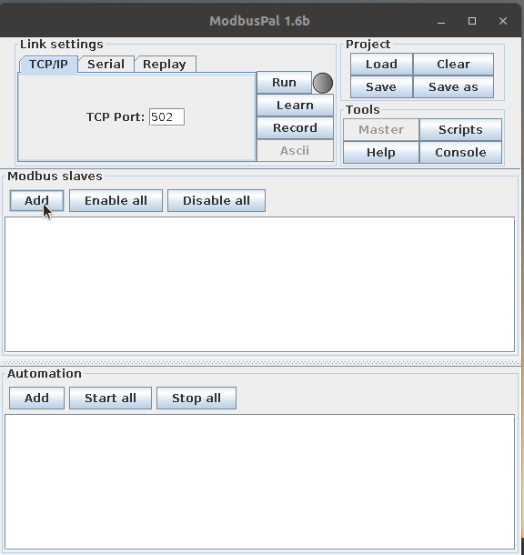

Add registers to slave device.
------------------------------
  #### Add a holding register
 - We will add a holding register with address 12
 
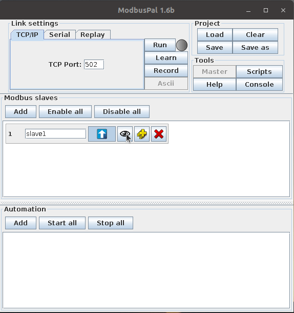

  #### Add two coils.
  - We will add two coils with addresses: 1 and 15. In field "Name" you can add names for variables. It doesn't affect on work, generally it will help you to understand which variable stands for current address.
 
 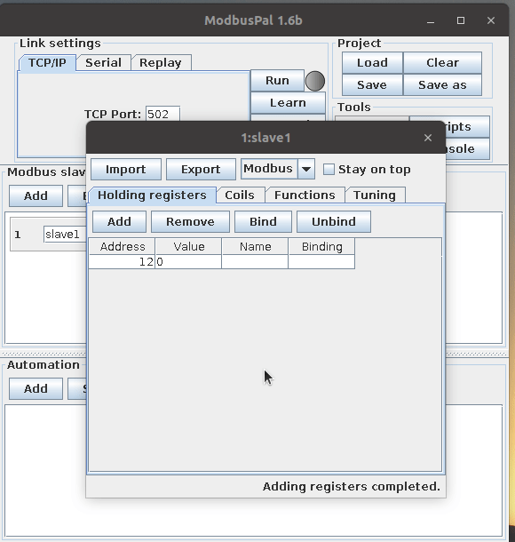

Run slave
---------
  - The modbus emulator can be available at `pc-ip-address:502`
  
 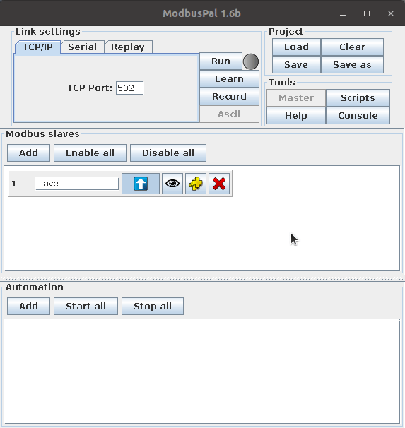
 
 Create model
 ------------ 
  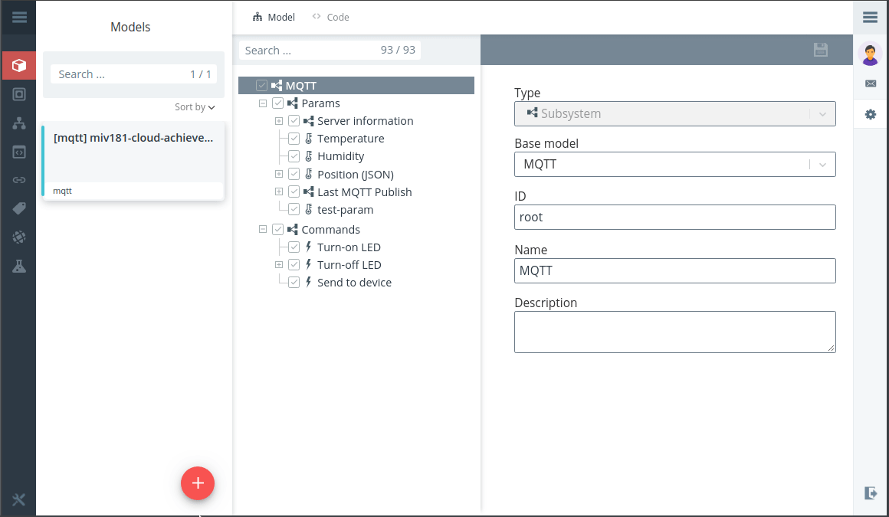
  
  #### Create commands for controlling Switches. 
  - SwitchA is a coil register with address: 1. SwitchB is a coil register with address: 15. Values can be 0 or 1.
  - For setting 1, in the field "Payload", set `{"SwitchA": "true"}`. For setting 0, set `{"SwitchA": "false"}`.Similarly change commands for SwitchB.
  - As you see, the general topic for commands is "Name" from "DeviceList".
  ```toml
  [[DeviceList]]
  # Device name, will be used as a base MQTT topic
  Name = "Modbus-TCP-test-device-11"
  # Profile name, see another.modbus.profile.yml
  Profile = "Another.Device.Modbus.Profile"
  Description = "This device is a product for monitoring and controlling digital inputs and outputs over a LAN."
  labels = [ "Air conditioner","modbus TCP" ]
  [DeviceList.Protocols]
    [DeviceList.Protocols.modbus-tcp]
       # Modbusl slave ip addres
       Address = "192.168.1.1"
       Port = "502"
       UnitID = "1"
  [[DeviceList.AutoEvents]]
    # After establishing registration, service will send every 20 seconds values of both switches to the platform 
    Frequency = "20s"
    OnChange = false
    Resource = "Switch"

  ```
  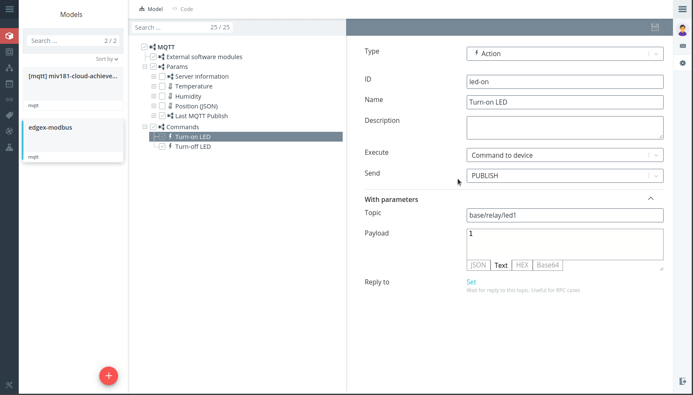
  
  #### Create command for getting state of both switches.
  
  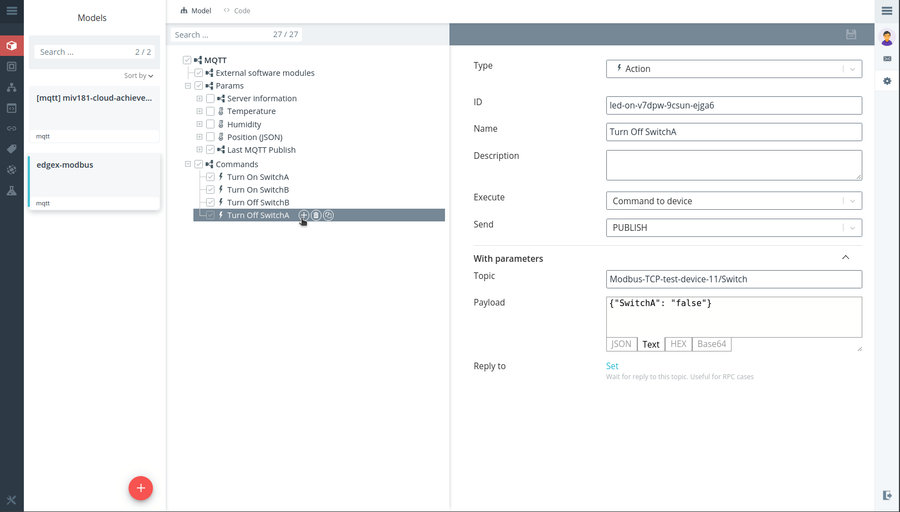
  
  
  #### Create command for setting operation mode.
   - Operation Mode is the holding register with address: 12.
   - Current operation modes are described in [another.modbus.profile.yml](./another.modbus.profile.yml)
   - To set Operation Mode, paste in "Payload" `{"OperationMode": "8"}`. This is "VAM Auto" mode.
   
   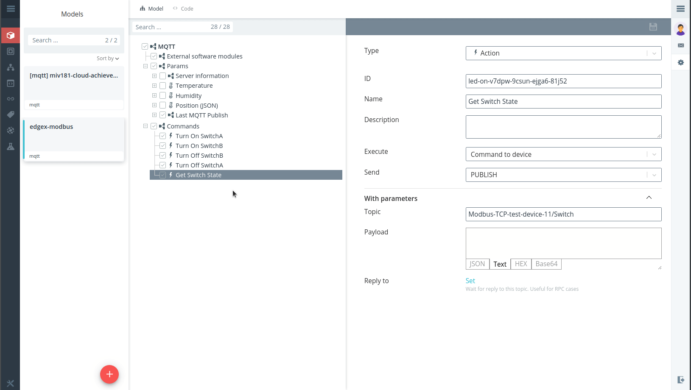
   
  #### Create command for getting operation mode.
   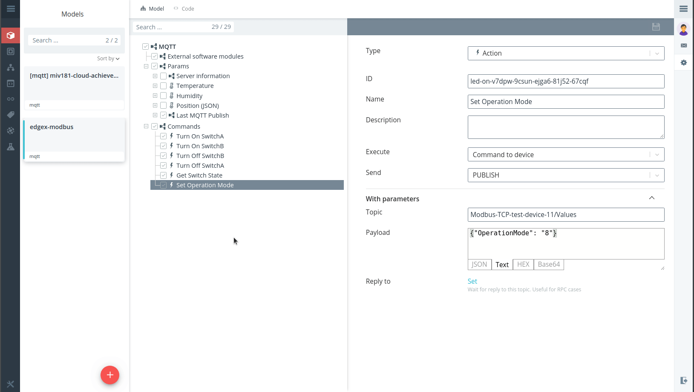
  
  #### Create an object in the platform.
   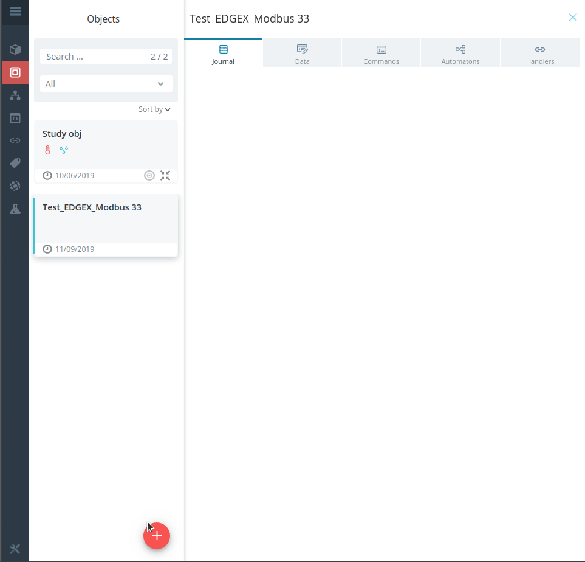
   
 
 Establish interaction between platform and modbus device.
 ---------------------------------------------------------
   - By default locate all necessary files: `docker-compose.yml, configuration.toml, another.modbus.profile.yml` in the same folder. 
   - Run Edgex services. Execute `docker-compose up -d`. 
   - Check whether services are running by `docker-compose ps`.
   - Edgex services UI will be available at `your-ip:4000`.
   - Add registration for establishing communication to the platform.

   ```shell: cURL
   curl -X POST -d '{                                       
  "name":"modbus-tutorial-example-thenew11",
  "addressable":{
      "name":"Broker",
      "protocol":"tcp",
      "address":"192.168.2.199",
      "port":1883,
      "publisher":"modbus-edgex-11",
      "topic":"mb-topic"
  },
  "format":"JSON",
  "filter":{
      "deviceIdentifiers":["Modbus-TCP-test-device-11"]
  },
  "enable":true,
  "destination":"IOTCORE_TOPIC"
}' http://localhost:48071/api/v1/registration
```
   - "address" is address of mqtt broker
   - "publisher" is an ID of object in the platform
   - "deviceIdentifiers" are names of devices  from [configuration.toml](./configuration.toml)
   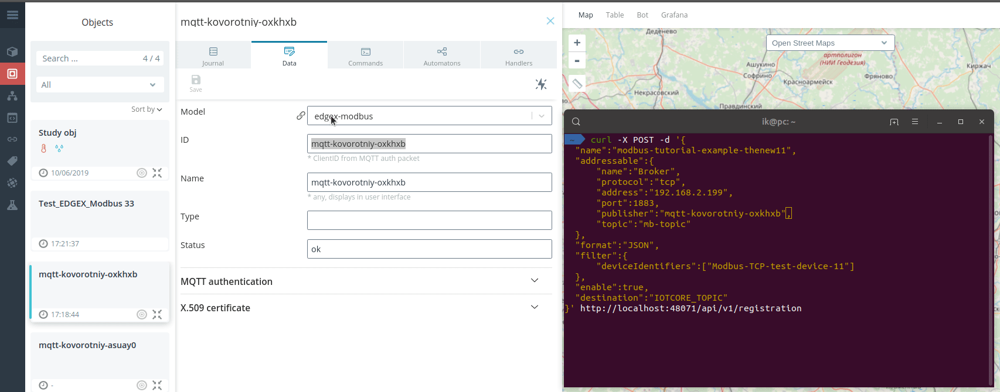
   
How it should work.
-------------------
   ##### Testing switches.
   - Check whether modbus emulator works.
   - For controlling registers values press "Eye" icon in modbus slave section
  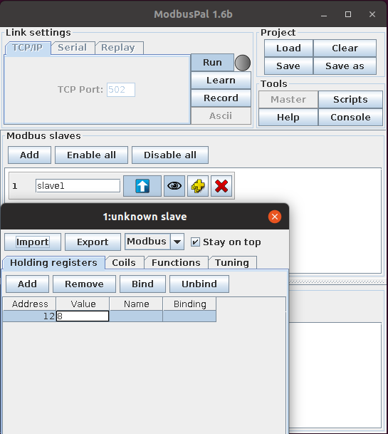 
  
   - How emulator works.
  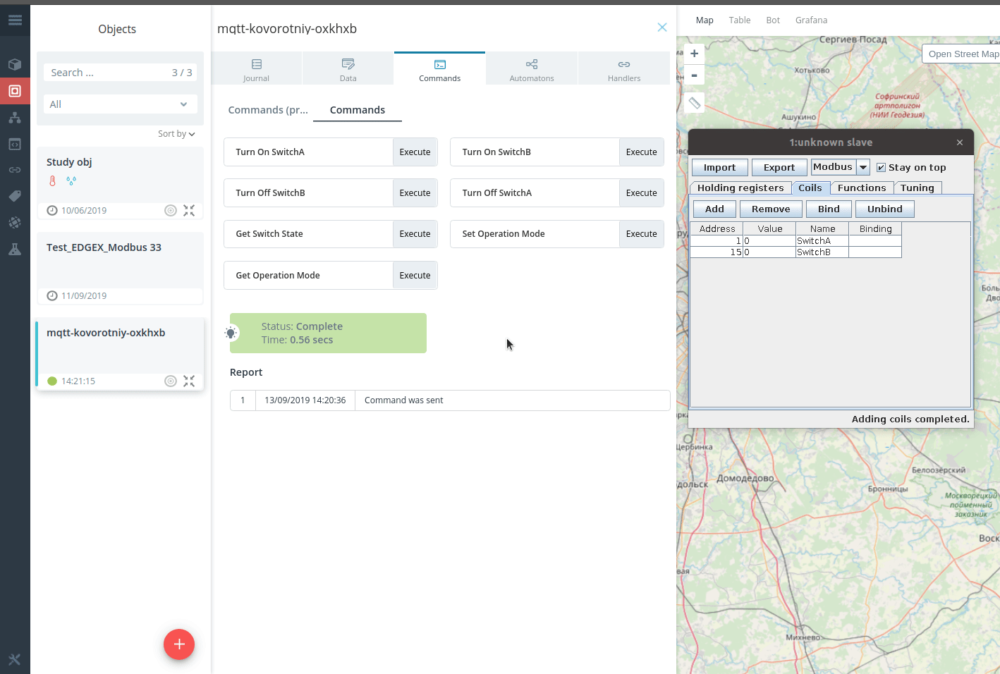
  
  ##### Testing operation mode
  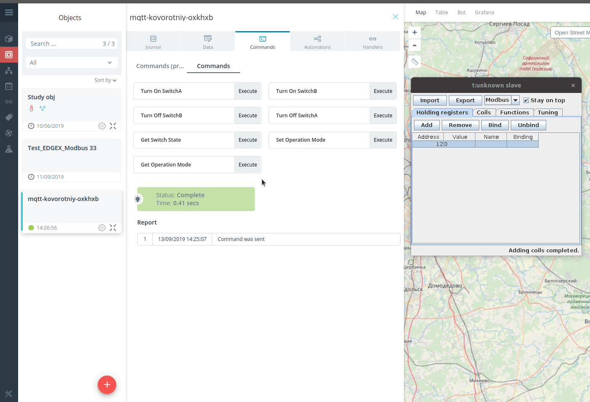
   
  
  
 
