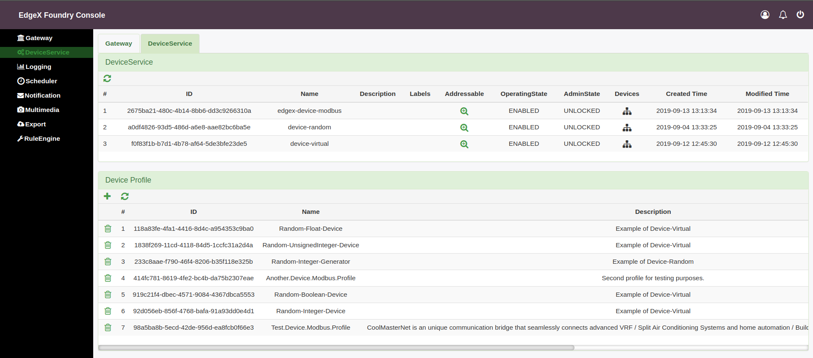

Further useful information for users.
====================================


Set up UI of Edgex services.
----------------------------

  1. Go to `your-ip:4000`
  
  2. Use login: `admin`, password: `admin`  to log in.
  
  3. Press add gateway, in field "Address" paste your ip-address.
  
  4. Select gateway, the go "DeviceService" section

 - This is UI of Edgex services.
 
 
Base commands for managing services.
------------------------------------
 - If you modified [another.modbus.profile.yml](./another.modbus.profile.yml) or [configuration.toml](./configuration.toml) and you will use the same service. Perform these commands.
  
  1. Get list of all registrations, execute `curl http://localhost:48071/api/v1/registration | json_pp`. It will look like:
  ```json
  [
   {
      "name" : "EdgeXRulesEngine",
      "created" : 1568384392374,
      "encryption" : {},
      "filter" : {},
      "modified" : 1568384392374,
      "origin" : 0,
      "id" : "4fc3ae88-73d6-4521-b97d-4f51f93147c5",
      "destination" : "ZMQ_TOPIC",
      "addressable" : {
         "protocol" : "ZMQ",
         "name" : "EdgeXRulesEngineAddressable",
         "method" : "POST"
      },
      "format" : "SERIALIZED",
      "enable" : true
   },
   {
      "filter" : {
         "deviceIdentifiers" : [
            "Modbus-TCP-test-device-11"
         ]
      },
      "modified" : 1568384515852,
      "destination" : "IOTCORE_TOPIC",
      "id" : "73b18bed-98c3-42a7-8cbf-0fb8b424f50b",
      "origin" : 0,
      "addressable" : {
         "topic" : "mb-topic",
         "baseURL" : "tcp://192.168.2.199:1883",
         "port" : 1883,
         "url" : "tcp://192.168.2.199:1883",
         "address" : "192.168.2.199",
         "protocol" : "tcp",
         "name" : "Broker",
         "publisher" : "mqtt-kovorotniy-oxkhxb"
      },
      "format" : "JSON",
      "enable" : true,
      "name" : "modbus-tutorial-example-thenew11",
      "created" : 1568384515852,
      "encryption" : {}
   }
]
```
  #### 2. Delete device registration, how to add, see https://github.com/kovorotniy/edgex-modbus-ric-tutorial#establish-interaction-between-platform-and-modbus-device. 
  Examle of deleting `modbus-tutorial-example-thenew11` registration. Make:
  
  ```shell:curl 
  curl -X "DELETE"  http://localhost:48071/api/v1/registration/id/73b18bed-98c3-42a7-8cbf-0fb8b424f50b
  ```
  It should return "true"
  
  #### 3. Delete device service, see [edgex-ui.png](./gifs/edgex-ui.png). Section: DeviceService.   
  Example of deleting `edgex-device-modbus` Make:
  
  ```shell:curl
  curl -X "DELETE" http://localhost:48071/api/v1/deviceservice/id/2675ba21-480c-4b14-8bb6-dd3c9266310a	
  ```
  It should return "true"
  
  #### 4. Delete device service addressable. To check addressable, press "Magnifier" icon, then you will see addresaable id. 
  Example of deleting addressable. Make: 
  
  ```shell:curl
  curl -X "DELETE" http://localhost:48081/api/v1/addressable/id/3036f4b7-3db4-4906-b44d-af3ff8ea8cbe 
  ```
   It should return "true"
  
  #### 5. Delete device profile. Use UI. See section: Device Profile. Press "Trash box" icon to delete profile
  
Restart services
-----------------
   1. Stop containers, execute `docker-compose down`
  
   2. Launch containers, execute `docker-compose up -d`
  
   3. Add new registrations according to profile alteration. Link: https://github.com/kovorotniy/edgex-modbus-ric-tutorial#establish-interaction-between-platform-and-modbus-device. 
  
  
  
